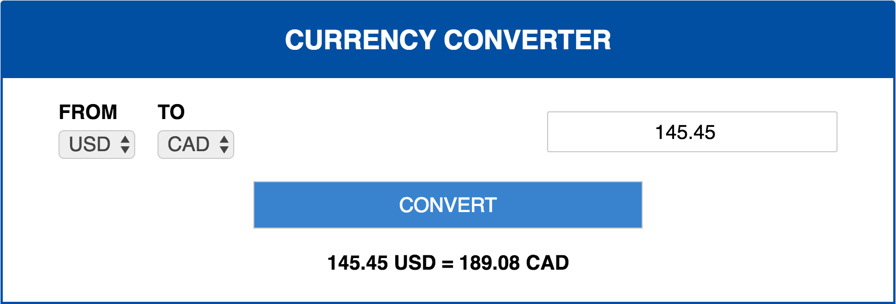

# Currency Converter

## Description

[Currency Converter] is a currency exchange converter application built with Ruby on Rails and React.js/Flux.
Its backend stores the exchange rates in a PostgreSQL database and makes an AJAX request to the Fixer.io API
once per 24 hours to fetch the most current rates. The app's RESTful JSON API serves this data to the React
frontend, which takes advantage of a Flux architecture.

[Currency Converter]: <https://currency-converter-react.herokuapp.com/>
